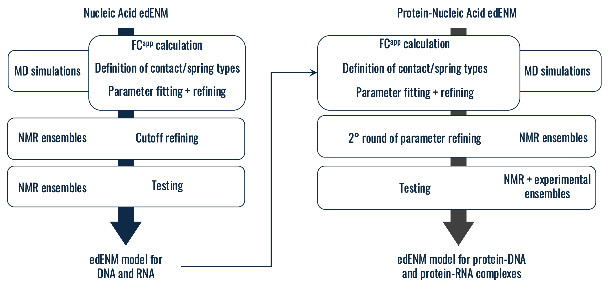
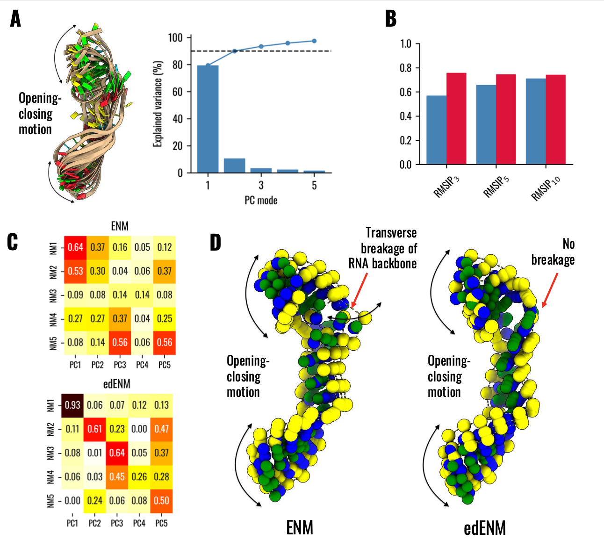
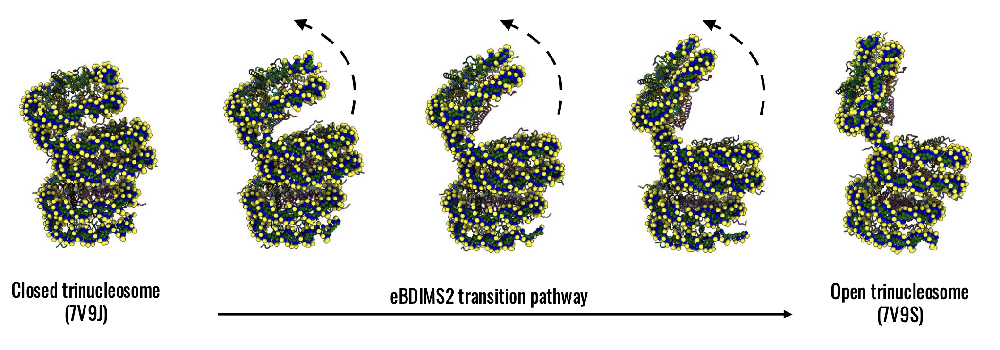

# Protein-DNA-RNA edENM
Codes to run the Essential Dynamics-based Elastic Network Model (edENM) of DNA, RNA, and protein-nucleic acid complexes, together with eBDIMS2 implementation for sampling of transition pathways.

The edENM is developed defining spring constants based on apparent force constants from Molecular Dynamics trajectories of DNA, RNA, and protein-nucleic acid systems. Refinement of spring constant parameters has been carried out by maximizing vector-space overlaps between normal modes (NMs) and principal components (PCs) of experimental ensembles: 

The code allows to reproduce the results shown in [INSERT PREPRINT LINK].

You can use it to compute NMs of DNA and RNA molecules and compare it with PC vectors from experimental data, e.g. NMR models:

As well as to compute harmonic motions of protein-nucleic complexes, employing the edENM parametrization for both the protein and nucleic acid components, e.g.:

Here you can also find the eBDIMS2 code () with the extension for nucleic acids and protein-nucleic acid complexes, in order to obtain transition pathways for conformational changes in large complexes, e.g.:

